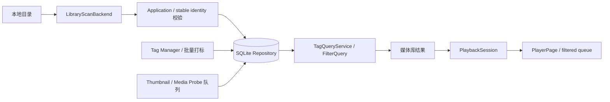

# Local Tag Player

**以标签驱动本地视频发现，而不是让你继续在文件夹树里翻找。**

Local Tag Player 是一款使用 Flutter 构建的跨平台桌面本地视频管理播放器。它面向“本地视频很多、目录分类已经不够用”的场景，把目录扫描、分组标签、组合筛选、收藏、搜索和筛选结果播放队列串成一个完整工作流。

它不是 PotPlayer、VLC 或专业剪辑播放器的替代品。项目更关注一件事：**快速找到想看的本地视频，并从当前筛选结果连续播放。**

[下载最新版本](https://github.com/Zero-1412/LocalTagPlayer/releases/latest) · [查看更新记录](CHANGELOG.md) · [阅读架构说明](ARCHITECTURE.md)

## 为什么创建这个项目

当本地媒体库不断增大时，单纯依靠“文件夹层级 + 文件名”会出现几个问题：

- 同一个视频只能放在一个目录，但它往往同时属于多个主题。
- 目录越分越深，查找路径越来越长，移动文件还可能丢失整理结果。
- 播放器通常擅长播放，却不擅长对大型本地库做标签发现和组合检索。
- 找到一个视频后，下一条常常又回到全库，而不是继续消费当前筛选结果。

Local Tag Player 因此把“播放器”放在标签发现闭环的末端：先扫描、归类、筛选，再让播放器消费当前结果队列。

## 特色功能

### 标签驱动的媒体库

- 添加一个或多个本地目录，递归建立 SQLite 媒体索引。
- 从媒体库根目录下的第一、第二层文件夹派生一级/二级 folder 标签。
- 支持 manual、folder、rule、filename、import、auto 等标签来源，避免自动标签和用户标签混淆。
- 支持标签分组、别名、收藏标签、隐藏与排序，以及当前筛选结果的批量打标。
- 不同标签组使用 AND、同组标签使用 OR，并支持 NOT 排除条件。

### 快速发现与浏览

- 统一搜索文件名、路径、标签名和标签别名。
- 当前筛选 chips、结果数量、名称/日期排序、网格与紧凑列表视图即时联动。
- 本地收藏、继续观看、本地目录浏览、缺失文件与重新关联均有独立入口。
- 媒体卡片可直接在文件管理器中定位当前视频，危险删除动作保留明确确认。

### 筛选结果就是播放队列

- 从媒体库打开视频时，播放器接收当前完整筛选结果，而不是退回全局列表。
- 右侧队列显示当前位置、缩略图、编码与分辨率，并支持搜索后直接播放匹配项。
- 播放事实与队列浏览选择相互隔离，返回媒体库后保留原筛选和滚动上下文。
- 支持继续播放、比例、倍速、镜像、播放方式、全屏和可配置快捷键。

### 稳定身份与数据保护

- 视频记录以稳定 `videoId` 为核心，路径被视为可变位置。
- 文件改名、缺失与重新关联尽量保留标签、收藏、播放记录和进度。
- 移除媒体库目录不会删除磁盘视频；单视频删除会明确区分“仅移出媒体库”和“移入回收站”。
- SQLite 数据和依赖备份保存在本机，不上传媒体路径、标签或观看记录。

### 面向大媒体库的后台协调

- 缩略图由 FFmpeg 生成并缓存，媒体信息通过受控 FFprobe/原生探测边界读取。
- 可见项目优先，后台任务限流、可取消；播放时降低扫描和缩略图任务负载。
- 缓存失败原因可见、可重试，不把 0-byte 或不完整文件当成有效结果。
- 扫描、探测、SQLite 写入和播放器释放均有明确的 generation、队列与生命周期边界。

## 技术框架

| 层级 | 技术与职责 |
| --- | --- |
| UI | Flutter、Dart、响应式桌面布局、键盘与鼠标交互 |
| 播放 | `media_kit` / `media_kit_video`，通过 `PlayerBackend` 隔离具体实现 |
| 数据 | SQLite、`sqflite_common_ffi`，保存视频身份、标签关系、收藏与播放状态 |
| 媒体工具 | FFmpeg 缩略图、FFprobe/原生媒体探测，通过平台 adapter 调用 |
| 文件系统 | `FileSystemAdapter` 统一选择、定位、改名、回收站与跨平台路径行为 |
| 桌面能力 | `window_manager`、拖放导入、Windows/macOS/Linux runner |

## 架构思想

项目采用“平台无关业务核心 + 显式平台边界”的 Flutter 桌面单体架构。SQLite schema、标签语义、稳定身份和筛选结果队列由 Dart 业务层统一拥有；Windows/macOS/Linux 的文件系统、播放器、数据库 Provider 和媒体工具都留在 adapter 后。



核心原则：

- UI 不复制过滤逻辑，组合查询统一经过 `FilterQuery` / `TagQueryService`。
- 播放器只消费来源页面传入的 filtered queue。
- folder 标签可以由路径重新计算，manual 标签必须由用户维护并被保留。
- 扫描与媒体探测只读文件；稳定身份判断和 SQLite 写入仍由 Application/Repository 层负责。
- 高频交互优先更新可见结果，计数、预取和后台探测延后或取消过期任务。

更完整的模块与数据流见 [ARCHITECTURE.md](ARCHITECTURE.md)。

## 下载与平台状态

请从 [GitHub Releases](https://github.com/Zero-1412/LocalTagPlayer/releases) 下载，不要从源码目录寻找安装包。

| 平台 | 产物 | 当前状态 |
| --- | --- | --- |
| Windows x64 | `.exe` 安装器 | 主要开发与验证平台；当前安装包未做 Authenticode 签名 |
| macOS | `.dmg` | 已完成 Release 构建与启动检查；当前未签名、未公证 |
| Linux | 源码构建 | CI 验证 adapter、构建与启动，暂未提供正式安装包 |

> 未签名版本可能触发 Windows SmartScreen 或 macOS Gatekeeper。请核对 Release 页面提供的 SHA-256；对外正式分发前仍需配置平台签名与公证。

## 从源码运行

前置条件：Flutter stable、对应平台桌面构建工具，以及项目声明的原生依赖。

```powershell
git clone https://github.com/Zero-1412/LocalTagPlayer.git
cd LocalTagPlayer
flutter pub get
flutter run -d windows
```

macOS 或 Linux 可分别使用 `flutter run -d macos`、`flutter run -d linux`。当前产品体验与性能基线仍以 Windows 为主。

## 验证

```powershell
flutter test
flutter analyze
flutter build windows --debug
```

跨平台构建与正式包生成由 `.github/workflows/` 中的 GitHub Actions 持续验证。打包细节见 [packaging/README.md](packaging/README.md)。

## 本地数据与隐私

- 应用只索引用户主动添加的本地目录，不上传视频、缩略图、标签或观看记录。
- 数据库、设置、诊断日志和缓存位于操作系统应用数据目录，不应提交到仓库。
- 仓库忽略本地数据库、日志、媒体样本、环境变量、签名证书、安装包和私有开发配置。
- 提交 Issue 时请先移除绝对路径、用户名、媒体标题和日志中的个人信息。

## 项目状态与边界

- 当前版本：`0.1.0+1`。
- 当前优先级：标签发现、稳定身份、标签维护、筛选队列、缓存诊断与跨平台发布。
- 暂不优先：字幕、音轨、逐帧、A-B loop 等专业播放器能力。
- 仓库当前尚未附项目级开源许可证；第三方组件与随包工具仍分别受其原始许可证约束。

项目背景、约定和后续方向可继续阅读 [PROJECT.md](PROJECT.md)、[CURRENT_TASK.md](CURRENT_TASK.md) 与 [CHANGELOG.md](CHANGELOG.md)。
